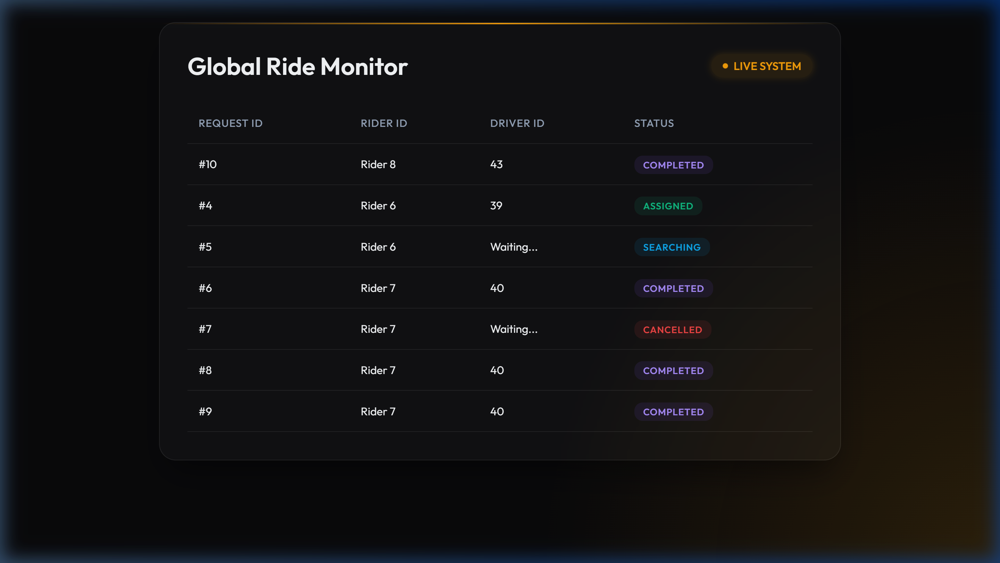

# Concurrent Ride Allocation System

This is a database-centric project built with FastAPI, PostgreSQL, and WebSockets. It is specifically designed to demonstrate **advanced PostgreSQL concurrency control** using raw SQL and row-level locking (`SELECT ... FOR UPDATE`), strictly avoiding any ORMs.

## Prerequisites
- **Python 3.10+**
- **Docker & Docker Compose** (for running the PostgreSQL database)

## 1. Setup the Database
The project uses a `docker-compose.yml` file to spin up a PostgreSQL instance with the necessary schema loaded automatically upon initialization.

Run the following command in the root directory to start the database:
```bash
docker-compose up -d
```
*Note: The database runs on port `5435` to prevent conflicts with local PostgreSQL instances.*

## 2. Setup the Python Environment
Create a virtual environment and install the required dependencies:
```bash
python -m venv venv
# Activate the virtual environment
# Windows:
.\venv\Scripts\activate
# Mac/Linux:
source venv/bin/activate

# Install requirements
pip install -r requirements.txt
```

## 3. Run the Backend Server
Start the FastAPI application using Uvicorn:
```bash
python -m uvicorn backend.main:app --port 8088 --reload
```
The server will be available at `http://localhost:8088`.

## 4. Test the System
### Web UI
You can open two different browser tabs to simulate a rider and a driver:
- **Rider Dashboard:** `http://localhost:8088/rider-dashboard`
- **Driver Dashboard:** `http://localhost:8088/driver-dashboard`

### Automated Concurrency Test
To verify the concurrency mechanics (ensuring 10 drivers accepting the exact same ride at the exact same millisecond results in only 1 successful assignment and 9 rejections), run:
```bash
pytest test_concurrency.py -v -s
```

### Postman
A `postman_collection.json` is included in the repository. You can import it into Postman to easily test the raw API endpoints.

## 5. Demo
Watch the system in action handling concurrent drivers:


And the final state of the Admin Panel monitoring all activities:


